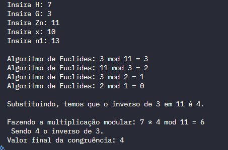

# Atividade - MD2

Atividade para nota de prova na matéria de Matemática Discreta 2. 

## Alunos

* **Eduardo Henrique Colacio de Sales** - 232014290
* **Thiago Gomes Pereira de Abreu** - 232014333

## Compilação

Utilizamos o gcc para compilar os arquivos da atividade
```bash
# Compilando o arquivo da questão 1
gcc ./q1.c -o ./q1.exe

# Executando
./q1.exe
```


## Respostas da Questão 4 - (Arthur Fernandes, 2025)

### Saída resultado da questão 4 (código completo em q4.c):   



###  Questões de verdadeiro ou falso:

-  ( V ) O algoritmo de Euclides estendido é utilizado para calcular o inverso modular de um número.

- ( F ) Se mdc(G, Zn) ≠ 1, o programa ainda consegue encontrar o inverso de G em Zn.

- ( V ) A operação (H * inverso) % Zn representa a divisão modular de H por G.

- ( V ) Se n1 for primo, o código aplica o Pequeno Teorema de Fermat para simplificar o cálculo de a^x mod n1.

- ( F ) A função powMod implementa o cálculo de potência modular utilizando multiplicações diretas sem otimização.

- ( V ) Quando o resultado do inverso é negativo, o código ajusta o valor somando o módulo m0.

- ( V ) O cálculo de fi(n1) (função totiente de Euler) é utilizado apenas quando n1 não é primo.